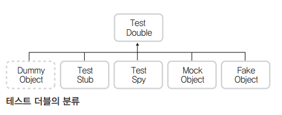

# Mock 객체
- 가짜 객체.
- 실제 객체를 만들기엔 비용과 시간이 많이 들거나 의존성이 길게 걸쳐져 있어 제대로 구현하기 어려울 때 사용.

# 언제 사용할 것인가?
1. 테스트 작성을 위한 환경 구축이 어려울 때.
- DB나 웹 서버 등을 설치해야만 테스트가 가능할 떄.
- 아직 해당 모듈이 개발되지 않아서 테스트가 불가할 때.
2. 테스트가 특정 경우나 순간에 의존적일 때.
- 특정 상태를 갖고 있는 Mock객체를 만들어서 테스트.

# 테스트 더블
- '대역, 스턴트맨'을 나타내는 스턴트 더블(Stunt Double)이라는 단어에서 차용해온 단어.     
- Mock 객체와 의미가 겹친다.

   
『xUnit Test Patterns』의 저자인 제라드 메스자로스(Gerard Meszaros)가 만든 분류.    

- 더미 객체 : 단지 인스턴스화될 수 잇는 객체.
- 스텁 : 인스턴스화된 객체가 특정 상태나 모습을 태표.
- 페이크 객체 : 여러 개의 인스턴스를 대표할 수 있음, 좀 더 복잡한 규현이 들어가 있는 객체.
- 스파이 : 객체의 스팩을 구현하고 추가로 테스트 하고 싶은 것들을 구현함.

# Mockito (Mock 프레임워크)
템플릿
```java
@Test
public void shouldDoSomethingCool() throws Exception {
    //given : 선행조건 기술

    //when : 기능 수행
    
    //then : 결과 확인
}
```
# Mock 사용 시 유의 사항
- Mock 프레임워크가 정말 필요한지 잘 따져본다.
>>Mock 객체가 적용될 수 있는 부분을 찾아내려고 애쓰지 말라.  
>>가능하면 설계를 바꿔서라도 Mock이 필요없는 의존성 적은 구조로 만들어라.
- 투자 대비 수익이 확실할 때만 사용한다.
- Mock은 Mock일 뿐이다.
>>Mock 객체는 실제 객체로 대체되어 테스트를 해야 하는 시점이 온다.  
>>따라서 초반부터 실제 객체를 테스트에 사용할 수 있다면, 그리고 그 비용이 많이 크지 않다면, Mock 객체를 사용하지 말자.